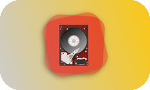
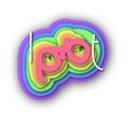

<samp>
  <h1 align="center">PierreJanineh.com</h1>
  

    Open-source packages and apps by <a href="https://github.com/PierreJanineh">@PierreJanineh</a>
  

</samp>

<h3 align="center">Packages</h3>

  <a href="https://github.com/PierreJanineh-com/ProgressUI"><strong>ProgressUI</strong></a> · Animated progress indicators for SwiftUI &nbsp;&nbsp;&nbsp;&nbsp;
   
  <a href="https://github.com/PierreJanineh-com/InfinityScrollKit"><strong>InfinityScrollKit</strong></a> · Infinite scroll for SwiftUI, UIKit & AppKit &nbsp;&nbsp;&nbsp;&nbsp;
   
  <a href="https://github.com/PierreJanineh-com/ClukUI"><strong>ClukUI</strong></a> · Clock visualizations for SwiftUI &nbsp;&nbsp;&nbsp;&nbsp;
   
  <a href="https://github.com/PierreJanineh-com/expo-quicklook-preview"><strong>expo-quicklook-preview</strong></a> · Expo module wrapping iOS QLPreviewController &nbsp;&nbsp;&nbsp;&nbsp;

<table align="center">
  <tr>
    <td align="center">
      
       
      Analyze & track technical debt via Model Context Protocol
      &nbsp;
      
    </td>
  </tr>
</table>

 

<h3 align="center">Apps</h3>

  
  &nbsp;&nbsp;&nbsp;
  
  &nbsp;&nbsp;&nbsp;
  
  &nbsp;&nbsp;&nbsp;
  
  &nbsp;&nbsp;&nbsp;
  

 

<samp>
  

    <a href="https://pierrejanineh.com">pierrejanineh.com</a> ·
    <a href="https://dev.to/pierrejanineh">Blog</a> ·
    <a href="https://medium.com/programming-with-pierre">Medium</a>
  

</samp>
